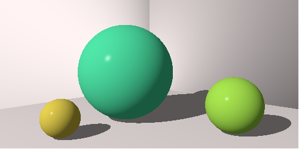

[](https://saftrare.visualstudio.com/GitRnD/_build/latest?definitionId=12)

# Ray

[The Ray Tracer Challenge](https://pragprog.com/book/jbtracer/the-ray-tracer-challenge) in .NET Core.


## Inspiration

Interested in a new coding challenge. Found [this](https://github.com/simonech/ray-tracer-challenge-netcore) repository and decided to do a similar project. I'm not forking that repository because:

* The [book and challenge](https://pragprog.com/book/jbtracer/the-ray-tracer-challenge) are presented as chapter-by-chapter and test driven.
    * So to work effectively I'll have to start from zero myself.
* I want to try using cuecumber / BDD style testing and this repo doesn't.

However I do plan to follow both the book and the [blog](https://codeclimber.net.nz/). So [simonech](https://github.com/simonech) will give me a good head-start. Perhaps I will fork the repo at a later date and offer some suggestions, depending on my findings.


# Design and Implementation

This project follows a published book on "Ray Tracing as a coding challenge". So design and implementation credit, first and foremost, has to go to the author [Jamis Buck](https://twitter.com/jamis?lang=en).

Thereafter, there were a few decisions I made early on and a few after some evolution that shaped the overall implementation.

## Early principles

I wanted to learn Cuecumber / BDD style test driven development. So that certainly shaped the test harness and allowed me to closely mirror the *contract* of the book.

I also decided *not* to model every class from first principles. Rather, if the .NET framework offered an appropriate implementation, I'd happily avail of it. This decision presented some challenges of it's own, but overall was a good one and probably kept my interest in the project for longer.

## Evolving opportunities

As I progressed through the challenge and had some nice images to boot, a couple of ideas were solidifying in my mind.

* Integrate with Docker as a simple way of documenting how to use the renderer.
    * Now it feels more like a product than a code repository.
* Stand-up an API.
    * Docker would give the run time environment and then the API would be the client contract for the backend renderer.
	
Pursuing these opportunities forced some changes and added another layer of code. 

Firstly, I wanted to target Linux containers. So there were a small number of classes that I had chosen which existed in the .NET Framework but not in .NET Core. These needed to be replaced.

Then it was a matter of creating that API layer. This led to some interesting challenges:

* Was it possible to describe the 3D worlds in Json.
    * Answer was Yes, not that difficult at all.
* Create new class hierarchy to represent the API contract.
* Ability to map from the API Json contract to the domain model used by the renderer.
* Decouple the API frontend and Image Rendering backend.
    * Async, background rendering - afterall images can take quite some time and physical resources to render in a ray tracer.
	* A modern approach would have the API and Renderer as completely separate deployment units, independently scalable.
	
To decouple the API frontend and Image Rendering backend I used [MediatR](https://github.com/jbogard/MediatR) and [.NET Core Hosted Service](https://docs.microsoft.com/en-us/dotnet/architecture/microservices/multi-container-microservice-net-applications/background-tasks-with-ihostedservice). MediatR to decouple code layers and .NET Core Hosted Service to decouple processing. This works very effectively in the demo app, but an enterprise solution might include a service bus, cloud job workers and SignalR notification for rendered images.


# Getting Started

Follow these instructions to build a Docker image from source, spin-up the API in the Docker runtime, fetch some example Json, use that Json to request an image render and finally poll for the completed image and download as a bitmap.

## Runtime

````
git clone https://github.com/cathalmchale/ray.git

# Change directory to the solution root, which includes file Ray.sln.
docker build --tag raywebapi:latest --file ./app/Ray.Web.Api/Dockerfile .

docker run -d -e "ASPNETCORE_ENVIRONMENT=Development" -e "ASPNETCORE_URLS=http://+:80" -p 8081:80 raywebapi:latest
````

## API

The runtime steps should make the API available over http on port 8081. To interact with the API, I recommend using Postman. Follow these steps to fetch some example Json from endpoint A, then post that Json to endpoint B and finally fetch the rendered image from endpoint C.

````
# Fetch some example Json
GET http://localhost:8081/scene/example

# Copy the example Json to the body of the next request.
#  Include header Content-Type: application/json
POST http://localhost:8081/scene

# The response from the post will look like:
{
    "correlationId": "fa22209d-5e53-47b7-8065-e7343d67b123",
    "pollUrl": "http://localhost:8081/Scene?id=fa22209d-5e53-47b7-8065-e7343d67b123",
    "message": "Scene submitted to renderer. When the image is ready, it can be fetched at the 'pollUrl' included. Depending on complexity, images can take quite some time to render."
}

# Follow the "pollUrl" to download the rendered image, when it's ready.
#  The example Json, posted as-is, should render in a few seconds.
GET http://localhost:8081/Scene?id=fa22209d-5e53-47b7-8065-e7343d67b123
````

## Output



